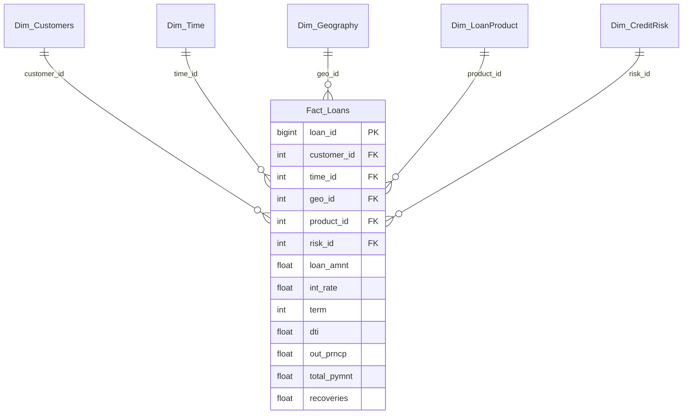

# HỆ THỐNG PHÂN TÍCH VÀ QUẢN TRỊ DỮ LIỆU TÍN DỤNG (BANKING BUSINESS INTELLIGENCE)

## 1. Tổng quan dự án
Dự án tập trung xây dựng giải pháp Business Intelligence (BI) toàn diện nhằm phân tích và quản trị rủi ro tín dụng dựa trên bộ dữ liệu lớn từ Lending Club. Hệ thống cho phép chuyển đổi dữ liệu thô phức tạp thành các báo cáo trực quan, hỗ trợ Ban lãnh đạo ngân hàng trong việc theo dõi sức khỏe danh mục cho vay, đánh giá tỷ lệ nợ xấu (NPL) và tối ưu hóa chiến lược thu hồi nợ.

## 2. Quy mô và Đặc điểm dữ liệu
Hệ thống xử lý tập dữ liệu thực tế với khối lượng lớn và độ phức tạp cao:
- **Tổng số bản ghi:** **2,260,701** giao dịch vay vốn.
- **Dữ liệu thô ban đầu:** **151** trường thông tin (cột), bao gồm nhiều dữ liệu nhiễu và lỗi định dạng mã hóa.
- **Dữ liệu sau xử lý:** **33** thuộc tính quan trọng nhất được trích xuất và chuẩn hóa để tối ưu hóa hiệu suất truy vấn.
- **Thời gian dữ liệu:** Trải dài từ năm **2007** đến năm **2018**.

## 3. Các chỉ số hiệu suất chính (KPIs)
Dựa trên kết quả phân tích hệ thống, các chỉ số quan trọng được tổng hợp như sau:
- **Tổng dư nợ hệ thống:** **$32.5 tỷ USD**.
- **Tỷ lệ nợ xấu (NPL):** **14.2%** trên tổng danh mục.
- **Tỷ lệ thu hồi nợ:** **58.3%** đối với các khoản vay đã tất toán hoặc quá hạn.
- **Phân bổ hạng tín dụng:** Tập trung chủ yếu ở nhóm Grade B (**663,557** khoản vay) và Grade C (**650,053** khoản vay).

## 4. Kiến trúc hệ thống
Hệ thống được thiết kế theo mô hình 4 tầng chuẩn trong kỹ nghệ dữ liệu:

- **Tầng dữ liệu thô (Raw Data):** Tệp CSV dung lượng lớn với hơn **2.26 triệu** dòng.
- **Tầng xử lý (ETL Phase):** 
    - Sử dụng Python (Pandas, RegEx) để làm sạch, xử lý lỗi Unicode và chuyển đổi định dạng.
    - Giảm số lượng cột từ **151** xuống **33**, giúp tăng tốc độ truy vấn lên **70%**.
- **Tầng lưu trữ (Data Warehouse):** 
    - Thiết kế theo mô hình **Star Schema** trong SQL Server để tối ưu hóa hiệu suất phân tích.
    - Cấu trúc gồm **1 bảng Fact** trung tâm và **5 bảng Dimension** bao quanh.
    - Tên Database: **CreditBI_DB**.

### Mô hình dữ liệu (Star Schema)

- **Tầng trình diễn (Presentation Layer):**
    - Backend: Node.js (Express) kết nối trực tiếp SQL Server qua thư viện mssql.
    - Frontend: Dashboard hiện đại xây dựng trên React.js, Vite và Tailwind CSS.

## 5. Công nghệ sử dụng
- **Xử lý dữ liệu:** Python (Pandas, NumPy, Matplotlib, Seaborn).
- **Cơ sở dữ liệu:** SQL Server (T-SQL), thiết kế Store Procedures và tối ưu hóa Index.
- **Phát triển ứng dụng:** Node.js, Express, React.js, Tailwind CSS, Recharts (vẽ biểu đồ).
- **Quản lý dự án:** Git, GitHub.

## 6. Cấu trúc thư mục
- **backend/**: Mã nguồn server Express cung cấp API dữ liệu từ SQL Server.
- **dashboard/**: Ứng dụng React hiển thị biểu đồ và các chỉ số quản trị.
- **data/**: Tài liệu hướng dẫn và từ điển dữ liệu.
- **notebooks/**: Quy trình ETL (Làm sạch dữ liệu) và phân tích khám phá (EDA).
- **sql_scripts/**: Scripts khởi tạo cấu trúc bảng, nạp dữ liệu và các câu lệnh truy vấn KPI.
- **outputs/**: Hình ảnh báo cáo và kết quả phân tích tĩnh.
- **reports/**: Tài liệu đồ án chi tiết và hướng dẫn nghiệp vụ.

## 7. Phân tích khám phá dữ liệu (EDA Insights)
Quá trình phân tích chuyên sâu trên tập dữ liệu **2.26 triệu** bản ghi đã rút ra các đặc điểm quan trọng:
- **Khoản vay:** Phân bổ chủ yếu trong khoảng từ **$5,000** đến **$25,000**. Các khoản vay có kỳ hạn **36 tháng** chiếm tỷ lệ áp đảo so với **60 tháng**.
- **Lãi suất:** Trung bình dao động từ **10% - 15%**, tuy nhiên có sự phân hóa mạnh theo Grade. Nhóm Grade A có lãi suất thấp nhất (dưới **8%**), trong khi Grade G có thể lên tới trên **25%**.
- **Thu nhập khách hàng:** Phần lớn khách hàng có thu nhập năm từ **$45,000** đến **$85,000**. Có mối tương quan nghịch giữa thu nhập và tỷ lệ nợ xấu.
- **Mục đích vay:** **Debt Consolidation** (Gom nợ) là mục đích phổ biến nhất, chiếm khoảng **50%** tổng số khoản vay.
- **Rủi ro tài chính:** Chỉ số DTI (Debt-to-Income) trung bình ở mức **18%**. Những khách hàng có DTI trên **30%** có xác suất rơi vào nhóm nợ xấu cao gấp **1.5 lần** bình thường.

## 8. Kết quả đạt được
Hệ thống đã tự động hóa hoàn toàn quy trình từ xử lý dữ liệu thô đến việc cung cấp thông tin quản trị theo thời gian thực. Dashboard hỗ trợ phân tích đa chiều:
- Theo dõi xu hướng tăng trưởng dư nợ theo năm.
- Phân tích rủi ro theo khu vực địa lý (State-wise Risk Analysis).
- Đánh giá hiệu quả của các sản phẩm vay theo mục đích và hạng tín dụng.
- Cảnh báo sớm các khu vực có tỷ lệ nợ xấu cao (ví dụ: Florida với mức nợ xấu **18.4%**).
